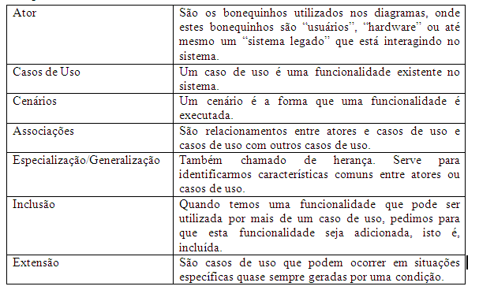

# PROJETO RH EM AÇÃO

### SOBRE

---

### EQUIPE

| NOME                  | FUNÇÃO             | RA           |
| ----------------------- | ---------------------- | -------------- |
| DANILO HOLANDA ARAUJO | SCRUM MASTER         | 202202150241 |
| DIEREE                | DBA                  | 202203882449 |
| ALBERTO               | REQUERIMENTS MANAGER |              |
| AMANDA                | FRONT-END            | 202202931306 |
| BEATRIZ               | FULL STACK           | 202202809225 |
| VITOR                 | SYSTEM ANALYST       | 202201048166 |

---

### ESTRUTURA DO CONTEUDO

#### **1 - Documentação de Requisitos**:

- Visão geral do produto
- Termos técnicos
- Abreviações e acrônimos
- Envolvidos e Usuários
- Requisitos (Funcionais, Não-Funcionais e Regras de Negócio)
- Casos de uso ou histórias de usuário.
- Diagramas de casos de uso, se aplicável.

#### **2 - Documentação de Arquitetura**

- Visão geral da arquitetura do sistema.
- Diagramas de arquitetura (por exemplo, diagrama de componentes, diagrama de implantação).
- Descrição dos principais componentes e sua interação.
- Decisões arquiteturais e justificativas.

#### **3 - Documentação de Design**:

- Diagramas de classes, sequência, estado, etc.
- Especificações detalhadas de cada componente ou módulo.
- Design de interfaces de usuário.
- Padrões de design utilizados.

#### **4 - Documentação de Testes**:

- ~~Plano de testes, incluindo casos de teste e critérios de aceitação.~~
- ~~Relatórios de testes realizados e resultados obtidos.~~
- ~~Registro de defeitos e problemas encontrados durante os testes.~~

#### **5 - Documentação de Código**:

- Comentários no código-fonte explicando a lógica e o propósito de partes específicas do código.
- ~~Documentação de API para bibliotecas ou módulos reutilizáveis.~~
- ~~Guia de contribuição para desenvolvedores que desejam colaborar com o projeto.~~

#### **6 - Documentação do Usuário**:

- Guia do usuário ou manual do usuário.
- Instruções passo a passo para usar o software.
- FAQs (perguntas frequentes) sobre o uso do software.

#### **7 - Documentação de Manutenção**:

- Instruções para instalação e configuração do software.
- Guia de solução de problemas e resolução de problemas comuns.
- Notas de versão e histórico de alterações.

---

#### **1 - Documentação de Requisitos**

---

- **Visão Geral do Produto**

\-> Este projeto foi criado utilizando a bibioteca React-Native de JavaScript para a criação de interfaces visuais para dispositivos móveis. Embora não seja um framework completo como Angular ou Vue.js, o React Native é uma biblioteca que permite criar interfaces de usuário nativas para iOS e Android usando componentes declarativos semelhantes aos do React.

Para a criação e estruturação do backend, faz-se necessário autilização de um superset de JavaScript chamado Typescript, o que permite a criação de código mais robusto e seguro. Além de adicionar uma tipagem estática de dados, o Typescript ofereceoutras funcionalidades como classes, enums, interfaces e etc.

- **Termos Técnicos**

| NOME         | DESCRIÇÃO                                                                                                              |
| -------------- | -------------------------------------------------------------------------------------------------------------------------- |
| JavaScript   | Linguagem de programação interpretada, versátil e uma das mais utilizadas para os mais diversos tipos de projetos.    |
| React Native | Uma biblioteca (library) para criar interfaces de usuário em aplicativos móveis.                                       |
| TypeScript   | Um superset da linguagem JavaScript que adiciona recursos de tipagem estática opcional e outros recursos ao JavaScript. |

- **Abreviações e acrônimos**

| NOME | DESCRIÇÃO              |
| ------ | -------------------------- |
| RF   | REQUISITO FUNCIONAL      |
| FRN  | REQUISITO NÃO FUNCIONAL |
| RS   | REQUISITO SUPLEMENTAR    |
| RNE  | REGRA DE NEGÓCIO        |
| UC   | USE CASE (CASO DE USO)   |
| MVC  | PADRÃO MODEL-VIEW-CONTROLLER|

- **Stakeholders**

\-> Este projeto possui inicialmente quantro stakeholders:

Professor orientador: Responsável por trazer "o problema a ser resolvido". Comunica os requisitos dos usuários administradores para os desenvolvedores e valida as etapasdo projeto.

Usuario administrador: Usuário mais privilegiado em relação a níveis de acesso ao sistema. Número limitado entre 10 e 15 contas utilizadas pelas pessoas que devem cadastrar as vagas de trabalho no sistema, além de alguns privilégios de edição e bloqueio de contas.

Usuario comum: O usuário com o nivel de acesso mais básico ao sistema. Utilizado por qualquer pessoa que queira ter acesso ao sistema e se candidataras vagasá cadastradas.

Usuario estuante: É um usuario comum, porém com algumas informações a mais, como matrícula semestre e curso matriculado.

- **Requisito**

\-Funcionais: Descrevem as funcionalidades do sistema.

| TIPO | ID  | DESCRIÇÃO                                                                                                            |
| ------ | ----- | ------------------------------------------------------------------------------------------------------------------------ |
| RF   | 001 | O SISTEMA DEVE POSSUIR A FUNÇÃO DE LOGIN UNICO PARA TODOS OS NÍVEIS DE USUÁRIO.                                    |
| RF   | 002 | O SISTEMA DEVE PERMITIR A NAVEGAÇÃO INICIAL ENTRE AS QUATRO TELAS BÁSICAS INICIAIS, INDEPENDENTEMENTE DO LOGIN.     |
| RF   | 003 | O SISTEMA DEVE POSSUIR A FUNÇÃO DE CADASTRO DE USUÁRIO ONDE FAÇA A DISTINÇÃO ENTRE USUÁRIO COMUM E ESTUDANTE.   |
| RF   | 004 | O SISTEMA DEVE POSSUIR A FUNÇÃO DE CADASTRO DE VAGAS DE EMPREGO RESTRITA A USUÁRIOS ADSMINISTRADORES.               |
| RF   | 005 | O USUÁRIO LOGADO PODERÁ SE CADASTRAR EM VAGAS SE PREENCHER OS REQUISITOS.                                            |
| RF   | 006 | DEVERÁ POSSUIR UMA FUNÇÃO DE COMPARAÇÃO ENTRE OS REQUISITOS MÍNIMOS DA VAGA E OS DADOS CURRICULARES DO USUÁRIO. |
| RF   | 007 | OS REQUISITOS MÍNIMOS E DIFERENCIAIS DE VAGA DEVEM SER DESCRITOS NO PRÓPRIO CADASTRO DA VAGA.                        |

\-Não Funcionais: Restrições, limites e especificações que o sistema deve possuir.

| TIPO | SUBTIPO     | ID  | DESCRIÇÃO                                                                        |
| ------ | ------------- | ----- | ------------------------------------------------------------------------------------ |
| RNF  | SOFTWARE    | 001 | O SISTEMA DEVE PODER SER EXECUTADO EM ANDROID, IOS E WEB.                          |
| RNF  | DESEMPENHO  | 002 | O SISTEMA ARMAZENARÁ SEUS DADOS EM UM BANCO DO ESTILO RELACIONAL PELO SGBD MySQL. |
| RNF  | DESIGN      | 003 | O SISTEMA UTILIZARÁ MODELO DE DESIGN SEGUINDO PADRÃO MVC.                        |
| RNF  | SOFTWARE    | 004 | O SISTEMA SERÁ PRODUZIDO UTILIZANDO DOIS PARADIGMAS: POO E POC.                   |
| RNF  | ARQUITETURA | 005 | O SISTEMA DEVERÁ SER CONSTRUIDO UTILIZANDO UMA ARQUITETURA MONOLÍTICA.           |

\-Suplementares: Restrições e limites aplicados a todo o sistema.

| TIPO | ID  | DESCRIÇÃO                                                                                                                                      |
| ------ | ----- | -------------------------------------------------------------------------------------------------------------------------------------------------- |
| RS   | 001 | EM TODAS AS TELAS DO SISTEMA, DEVE EXISTIR O LOGO DA ESTÁCIO E NOME DA APLICAÇÃO, EM QUE QUANDO PRESSIONADOS, LEVEM O USUARIO A TELA INICIAL. |

\-Regra de Negócio: São premissas e/ou restrições aplicadas a uma operação comercial de uma empresa por exemplo.

| TIPO | ID  | DESCRIÇÃO                                                                          |
| ------ | ----- | -------------------------------------------------------------------------------------- |
| RNE  | 001 | APENAS O USUÁRIO ADMINISTRADOR DEVE PODER CADASTRAR  VAGAS NO SISTEMA.             |
| RNE  | 002 | APENAS O USUÁRIO ESTUDANTE E VAGAS PODERÃO CADASTRAR MATRÍCULA, CURSO E SEMESTRE  |
| RNE  | 003 | APENAS O USUÁRIO COMUM E ESTUDANTE PODERÃO CADASTRAR CONTAS.                       |
| RNE  | 004 | SÓ PODERÁ SE CADASTRAR EM UMA VAGA QUEM FOR CADASTRADO.                            |
| RNE  | 005 | APENAS O PRÓPRIO USUÁRIO E ADMINISTRADORES TERÃO ACESSO AOS DADOS CRIPTOGRAFADOS. |

* **Casos de uso ou histórias de usuário.**

-> Os diagramas de caso de uso descrevem funções de alto nível e escopo de um sistema. Esses diagramas também identificam as interações entre o sistema e seus agentes. Os casos de uso e os agentes nos diagramas de caso de uso descrevem o que o sistema faz e como os agentes o usam, mas não como o sistema opera internamente.

-Atores:

1. Usuário, Usuário comum, Usuario estudante e Usuario administrador;
2. Usuário comum possui dados comuns de usuário e é um Usuário;
3. Usuário estudante possui dados de estudante e é um Usuário comum que é um Usuário;
4. Usuário administrador possui privilégios além dos outros tipos de usuários, portanto é um usuário com atributos próprios porém não é usuário comum nem estudante;

O diagrama acima mostra a especialização/generalização de entidades/atores o que é definido como herança em POO (Paradigma orientado a objetos).

Paradigma Orientado a Objetos:
O paradigma orientado a objetos (POO) é um modelo de programação que organiza o software em unidades chamadas objetos. Cada objeto representa uma instância de uma classe, que define um tipo específico de objeto. As classes podem ter atributos (dados) e métodos (funções) que operam nesses dados. O POO baseia-se em quatro princípios fundamentais:

- Abstração
- Encapsulamento
- Herança
- Polimorfismo

-Casos de Uso:

1. Login(): Representa a ação de autenticação do usuário do sistema. Utilizado por todos os atores.
2. Cadastro(): Cadastro de dados e currículo dos atores. Utilizado por todos os atores exceto pelo Usuario Administrador que utiliza uma conta pré criada.
3. Exibir perfil(): Função de exibição de dados do perfil.
4. Alterar dados cadastrais(): Usuarios comuns e estudantes podem alterar seus dados a qualquer momento.
5. Excluir conta(): Todos podem excluir suas contas criadas, exceto o Usuário administrador.
6. Candidatar em vaga(): Função de usuários comuns e estudantes para se cadastrar em vagas.
7. Desistir da vaga(): Cancelar candidatura em vaga.
8. Ver vagas candidatado(): Exibir lista de vagas cadastrado e o status da candidatrura.
9. Cadastrar vaga(): Exclusivo do Usuário administrador. Cadastra vagas no sistema.
10. Editar vaga(): Exclusivo do Usuário administrador. Edita vaga cadastrada.
11. Remover vaga(): Exclusivo do Usuário administrador. Remove vaga cadastrada.
12. Bloquear candidato(): Exclusivo do Usuário administrador. Bloqueia/Congela conta de candidato.

-Cenários:

| TIPO | ID  | NOME        | DESCRIÇÃO                                                                                                                                                                                                  |
| ------ | :---- | ------------- | -------------------------------------------------------------------------------------------------------------------------------------------------------------------------------------------------------------- |
| UC   | 001 | LOGIN       | NESTE CENÁRIO O USUÁRIO CONSEGUE LOGAR NORMALMENTE, É AUTENTICADO E TEM ACESSO AOS DEMAIS RECURSOS DO APLICATIVO.                                                                                         |
| UC   | 002 | LOGIN       | AO ERRAR A SENHA OU TENTAR ACESSAR SEM TER UMA CONTA AUTENTICADA. O USUÁRIO É IMPEDIDO DE ACESSAR AS FUNCIONALIDADES DO SISTEMA COM UMA MENSAGEM SUGERINDO QUE ENTRE COM UMA CONTA VÁLIDA OU CADASTRE-SE. |
| UC   | 003 | LOGIN       | O USUÁRIO NÃO POSSUI CONTA E ESCOLHE A OPÇÃO "CADASTRAR"                                                                                                                                                 |
| UC   | 004 | LOGIN       | O USUÁRIO ESQUECEU A SENHA E AO ESCOLHER A OPÇÃO "ESQUECEU SUA SENHA?". É DIRECIONADO A TRATATIVA DE RESET DE SENHA.                                                                                     |
| UC   | 005 | HOME        | AO ENTRAR NO APLICATIVO, O USUÁRIO PODERÁ. SE JÁ LOGADO, OBTER EM PRIMEIRO MOMENTO, UM PEQUENO HISTÓRICO DE VAGAS E SUGESTÕES BASEADAS EM SEU CURSO E HISTÓRICO DE PESQUISA.                           |
| UC   | 006 | HOME        | AINDA NA TELA INICIAL, O USUÁRIO TERÁ UMA IMAGEM-LINK QUE O GUIARÁ PARA O SITE/APLICATIVO ESTÁCIO.                                                                                                       |
| UC   | 007 | NAVEGAÇÃO | O USUÁRIO PODERÁ NAVEGAR ENTRE AS QUATRO TELAS BÁSICAS DO SISTEMA A QUALQUER MOMENTO ATRAVÉS DA BARRA DE NAVEGAÇÃO.                                                                                    |
| UC   | 008 | BUSCA       | O USUÁRIO CADASTRADO PODERÁ BUSCAR, FILTRAR E SE CANDIDATAR EM VAGAS DISPONÍVEIS NO SISTEMA.                                                                                                              |
| UC   | 009 | BUSCA       | O USUÁRIO AINDA NÃO CADASTRADO PODERÁ BUSCAR, FILTRAR, PORÉM AO TENTAR SE INSCREVER EM UMA VAGA, DEVERÁ SEGUIR PARA O CADASTRO.                                                                         |
| UC   | 010 | CADASTRO    | O USUARIO COMUM OU ESTUDANTE PODERÃO EFETUAR SEU CADASTRO COM DADOS PESSOAIS E CURRICULARES, SENDO QUE O ESTUDANTE DEVERÁ INFORMAR A MATRÍCULA, CURSO E SEMESTRE.                                         |
| UC   | 011 | CADASTRO    | O USUARIO ADMINISTRADOR PODERÁ CADASTRAR VAGAS AO SISTEMA.                                                                                                                                                  |
| UC   | 012 | EXIBIR      | OS DADOS DO USUÁRIO SERÃO CRIPTOGRAFADOS. PORTANTO, APENAS ALGUNS DADOS SERÃO EXIBIDOS (PÚBLICOS) PARA REFERÊNCIA QUANTO AOS REQUISITOS DAS VAGAS.                                                      |
| UC   | 013 | EXIBIR      | APENAS O ADMINISTRADOR E O PRÓPRIO USUÁRIO CADASTRADO PODERÃO TER ACESSO AOS SEUS DADOS CRIPTOGRAFADOS.                                                                                                   |
| UC   | 014 | EDIÇÃO    | USUÁRIO EDITA SEUS DADOS.                                                                                                                                                                                   |
| UC   | 015 | EDIÇÃO    | ADMINISTRADOR EDITA AS VAGAS CADASTRADAS.                                                                                                                                                                    |
| UC   | 016 | DELETE      | O USUÁRIO COMUM OU ESTUDANTE EXCLUI SUA CONTA.                                                                                                                                                              |
| UC   | 017 | DELETE      | O USUÁRIO ADMINISTRADOR EXCLUI A VAGA ANTERIORMENTE CADASTRADA.                                                                                                                                             |
| UC   | 018 | BLOQUEIA    | O USUÁRIO ADMINISTRADOR BLOQUEIA A CONTA DO USUÁRIO COMUM OU ESTUDANTE.                                                                                                                                    |

* **Diagramas de casos de uso**

->O diagrama de casos de uso possui uma importância complementar, pois não cabe em todos os cenários propostos pela aplicação e nos que cabe, filtra-se apenas aqueles em que realmente possa auxiliar no entendimento do processo.

O diagrama acima demonstra o reuso utilizado em POC (Paradigma orientado a componentes).

Paradigma Orientado a Componentes:
O paradigma orientado a componentes (POC) é um modelo de desenvolvimento de software que se concentra na construção de sistemas a partir de componentes reutilizáveis e independentes. Os componentes são unidades de software que encapsulam funcionalidades específicas e podem ser compostos para formar sistemas mais complexos. As principais características do POC incluem:

- Reutilização
- Encapsulamento
- Composição
- Integração

Embora o POO e o POC tenham abordagens diferentes, ambos visam promover a reutilização, a modularidade e a manutenibilidade do software, cada um com suas próprias técnicas e princípios.

O diagrama acima mostra o comportamento principal dos três níveis de uruário em relação as vagas. Neste cenário, o administrador cadastra as vagas que são buscadas e acessadas pelos usuários cadastrados e não cadastrados, porém apenas usuários cadastrados poderão se candidatar a elas.

---

#### **2 - Documentação de Arquitetura**

---

* **Visão geral da arquitetura do sistema**

->A documentação de arquitetura para um projeto React Native descreve a estrutura e o design geral do sistema, incluindo a organização dos componentes, a comunicação entre eles e a forma como o sistema é implantado. Essa documentação fornece informações detalhadas sobre a arquitetura do projeto, facilitando o entendimento e a manutenção do código por parte dos desenvolvedores.

Um projeto React Native pode ser tanto monolítico quanto baseado em microserviços, dependendo da arquitetura escolhida para o desenvolvimento. Vamos entender a diferença entre os dois:

1. **Monolítico** : Um aplicativo monolítico é aquele em que todas as funcionalidades são desenvolvidas e implantadas como um único sistema. Isso significa que todas as partes do aplicativo, como a interface do usuário, a lógica de negócios e o acesso a dados, estão contidas em um único código-base e são implantadas como uma única unidade. Nesse caso, um projeto React Native monolítico teria toda a lógica do aplicativo (telas, regras de negócio, acesso a dados, etc.) dentro de um único aplicativo React Native.
2. **Microserviços** : Um aplicativo baseado em microserviços é aquele em que as funcionalidades são divididas em serviços independentes, cada um responsável por uma parte específica da aplicação. Cada microserviço é desenvolvido, implantado e escalado de forma independente, o que permite uma maior flexibilidade e escalabilidade do sistema como um todo. Nesse caso, um projeto React Native baseado em microserviços teria cada serviço sendo executado em seu próprio ambiente, e a comunicação entre eles seria feita por meio de APIs.

* **Diagramas de arquitetura**

Diagrama de Componentes de Dados e Acesso:

Diagrama de Fluxo de Dados:

Diagrama Físico de dados

Para criar este diagrama, utilizamos o MySQL pois foi o SGBDR utilizado para criar a nossa base de dados.

* **Descrição dos principais componentes e sua interação**

| TIPO    | NOME        | DESCRIÇÃO                                                                                                          |
| --------- | ------------- | ---------------------------------------------------------------------------------------------------------------------- |
| INTERNO | VIEWS       | SÃO AS TELAS (VISUALIZAÇÃO) RESPONSÁVEISO POR EXIBIR AS INTERAÇÕES DO SISTEMA PARA O USUÁRIO.                 |
| EXTERNO | VIEW        | COMPONENTE RESPONSÁVEL POR AGRUPAR OUTROS COMPONENTES. UTILIZADO AMPLAMENTE EM TODOS OS COMPONENTES VIZUAIS.        |
| INTERNO | STYLESHEETS | FOLHAS DE ESTILO EQUIVALENTE AO CSS EM SISTEMAS WEB. RESPONSÁVEL POR APLICAR ESTILOS AOS COMPONENTES VISUAIS.       |
| EXTERNO | TEXT        | COMPONENTE UTILIZADO PARA INSERIR TEXTO AOS COMPONENTES VIZUAIS.                                                     |
| INTERNO | ENTITIES    | SEMELHANTE A MODEL DA ARQUITETURA MVC. REPRESENTA AS ENTIDADES, ATORES E SUAS FUÇÕES.                              |
| INTERNO | NAVIGATORS  | RESPONSÁVEIS PELA COMUNICAÇÃO E NAVEGAÇÃO ENTRE TELAS                                                           |
| INTERNO | CONTROLLERS | RESPONSÁVEL PELA COMUNICAÇÃO ENTRE NAVIGATOR, VIEWS E MODELS.                                                     |
| INTERNO | APP         | COMPONENTE PRINCIPAL DA APLICAÇÃO, ONDE OCORRE A NAVEGAÇÃO PRINCIPAL ENTRE TELAS E EMPILHAMENTO DE NAVEGAÇÕES. |

Estes componentes foram melhor detalhados na documentação de design.

* **Decisões arquiteturais e justificativas.**

A escolha da arquitetura monolítica foi apropriada em várias sentidos, e que dependeu dos requisitos e das características do projeto. Algumas razões paraa escolhaarquitetura monolítica incluem:

1. Simplicidade : Uma arquitetura monolítica é mais simples de entender, desenvolver e manter em comparação com arquiteturas distribuídas ou baseadas em microserviços. Isso é vantajoso no caso de nossa equipe pequena e pouco experiente.
2. Custo : A construção e a manutenção de uma aplicação monolítica geralmente requerem menos infraestrutura e recursos em comparação com arquiteturas distribuídas, o que pode ser mais econômico para pequenas e médias empresas.
3. Desenvolvimento rápido : Uma arquitetura monolítica pode permitir um desenvolvimento mais rápido, pois os desenvolvedores podem se concentrar em uma única aplicação sem a complexidade adicional de gerenciar várias partes independentes.
4. Facilidade de implantação : Implantar uma aplicação monolítica é mais simples do que implantar uma aplicação distribuída, pois envolve apenas a implantação de um único artefato.
5. Menos complexidade inicial : Para projetos que não exigem escalabilidade imediata ou que têm requisitos de negócios relativamente simples, uma arquitetura monolítica pode ser uma escolha adequada devido à sua menor complexidade inicial.

---

#### **3 - Documentação de Design**

---

* **Diagramas de classes, sequência, estado, etc.**

Diagrama de classe:

O diagrama de classes é uma ferramenta fundamental na modelagem de sistemas orientados a objetos, como é o caso de muitas aplicações desenvolvidas em React Native. Ele desempenha várias funções importantes:

-Componentes internos:

| TIPO       | NOME                 | DESCRIÇÃO                                                                                                          |
| ------------ | ---------------------- | ---------------------------------------------------------------------------------------------------------------------- |
| VIEW       | App.js               | COMPONENTE PRINCIPAL DA APLICAÇÃO, ONDE OCORRE A NAVEGAÇÃO PRINCIPAL ENTRE TELAS E EMPILHAMENTO DE NAVEGAÇÕES. |
| VIEW       | Busca.js             | TELA DE BUSCA POR VAGAS.                                                                                             |
| VIEW       | Cadastro.js          | TELA DE CADASTRO DE USUÁRIO COMUM OU ESTUDANTE.                                                                     |
| VIEW       | ~~Contato.js~~       | TELA A SER MODIFICADA.                                                                                               |
| VIEW       | Home.js              | TELA INICIAL >> PRIMEIRAS INFORMAÇÕES.                                                                             |
| VIEW       | Perfil.js            | NOME A SER AJUSTADO. TELA DE LOGIN.                                                                                  |
| CONTROLLER | PerfillStack.js      | INTERFACE DE NAVEGAÇÃO ENTRE A TELA DE LOGIN E CADASTRO.                                                           |
| CONTROLLER | TabNavigatorStack.js | INTERFACE DE NAVEGAÇÃO ENTRE A BARRA DE NAVEGAÇÃO E AS QUATRO TELAS BÁSICAS INICIAIS.                           |
| MODEL      | Entidades.tsx        | TODAS AS ENTIDADES CONTIDAS NESTE SISTEMA.                                                                           |
| STYLESHEET | estilo-busca.js      | FOLHA DE ESTILO DE COMPONENTES INDIVIDUAIS DA TELA BUSCA.                                                            |
| STYLESHEET | estilo-geral.js      | FOLHA DE ESTILO DE COMPONENTES PADRÕES EM TODO O APLICATIVO.                                                        |
| STYLESHEET | estilo-perfil.js     | FOLHA DE ESTILO DE COMPONENTES INDIVIDUAIS DA TELA DE LOGIN.                                                         |
| STYLESHEET | estilo-home.js       | FOLHA DE ESTILO DE COMPONENTES INDIVIDUAIS DA TELA INICIAL.                                                          |
| VIEW       | HeaderMain.js        | CABEÇALHO >> NOME DO APLICATIVO + LOGOTIPO                                                                          |

-Componentes externos:

| NOME                     | PACOTE                        | DESCRIÇÃO                                                                                                                                                                                                            |
| :------------------------- | ------------------------------- | ------------------------------------------------------------------------------------------------------------------------------------------------------------------------------------------------------------------------ |
| View                     | react-native                  | COMPONENTE UTILIZADO PARA AGRUPAR OUTROS COMPONENTES E CRIAR LAYOUTS. É SEMELHANTE A UMA`
` EM APLICAÇÕES WEB.                                                                                                  |
| SafeAreaView             | react-native                  | COMPONENTE QUE GARANTE QUE SEU CONTEÚDO NÃO SEJA SOBREPOSTO PELA ÁREA DE STATUS DO DISPOSITIVO. É ÚTIL PARA EVITAR QUE CONTEÚDO SEJA CORTADO EM DISPOSITIVOS COM ENTALHE (NOTCH) OU BARRA DE STATUS.             |
| Image                    | react-native                  | COMPONENTE UTILIZADO PARA EXIBIR IMAGENS. PODE EXIBIR IMAGENS LOCAIS (DO DISPOSITIVO) OU REMOTAS (DA INTERNET).                                                                                                        |
| Stylesheet               | react-native                  | OBJETO UTILIZADO PARA DEFINIR ESTILOS EM COMPONENTES REACT NATIVE.                                                                                                                                                     |
| Text                     | react-native                  | COMPONENTE UTILIZADO PARA EXIBIR TEXTO NA INTERFACE DO USUÁRIO. SUPORTA ESTILOS, COMO COR, TAMANHO DA FONTE E ALINHAMENTO.                                                                                            |
| TextInput                | react-native                  | COMPONENTE UTILIZADO PARA RECEBER ENTRADA DE TEXTO DO USUÁRIO. É SEMELHANTE A UM`<INPUT>` EM APLICAÇÕES WEB.                                                                                                       |
| TouchableOpacity         | react-native                  | COMPONENTE UTILIZADO PARA ENVOLVER OUTROS COMPONENTES E ADICIONAR UM EFEITO DE "TOQUE" QUANDO PRESSIONADO, FORNECENDO FEEDBACK VISUAL AO USUÁRIO.                                                                     |
| Switch                   | react-native                  | OMPONENTE UTILIZADO PARA REPRESENTAR UM INTERRUPTOR DE DUAS OPÇÕES (LIGADO/DESLIGADO). É SEMELHANTE A UMA CAIXA DE SELEÇÃO (CHECKBOX) EM APLICAÇÕES WEB.                                                        |
| NavigationContainer      | @react-navigation/native      | COMPONENTE UTILIZADO PARA ENVOLVER A NAVEGAÇÃO EM UMA APLICAÇÃO REACT NATIVE. É RESPONSÁVEL POR GERENCIAR O ESTADO DA NAVEGAÇÃO E RENDERIZAR A NAVEGAÇÃO COM BASE NOS COMPONENTES DE NAVEGAÇÃO FORNECIDOS. |
| createBottomTabNavigator | @react-navigation/bottom-tabs | FUNÇÃO UTILIZADA PARA CRIAR UM NAVEGADOR DE ABAS NA PARTE INFERIOR DE UMA APLICAÇÃO REACT NATIVE. PERMITE DEFINIR AS ROTAS E AS OPÇÕES DE CADA ABA, BEM COMO A CONFIGURAÇÃO GERAL DO NAVEGADOR.                |
| useNavigation            | @react-navigation/native      | HOOK UTILIZADO PARA OBTER O OBJETO DE NAVEGAÇÃO EM COMPONENTES FUNCIONAIS DENTRO DE UM NAVEGADOR. PERMITE ACESSAR FUNÇÕES DE NAVEGAÇÃO, COMO NAVIGATE E GOBACK, E O ESTADO DA NAVEGAÇÃO.                       |
| useState                 | react                         | HOOK UTILIZADO PARA ADICIONAR ESTADO A COMPONENTES FUNCIONAIS EM REACT. PERMITE DEFINIR E ATUALIZAR O ESTADO DE UM COMPONENTE, DISPARANDO UMA RE-RENDERIZAÇÃO QUANDO O ESTADO É ALTERADO.                           |
| React                    | react                         | BIBLIOTECA JAVASCRIPT UTILIZADA PARA CRIAR INTERFACES DE USUÁRIO INTERATIVAS. É A BASE DO REACT NATIVE E FORNECE OS COMPONENTES E API NECESSÁRIOS PARA O DESENVOLVIMENTO DE APLICAÇÕES REACT NATIVE.              |
| LinearGradient           | expo-linear-gradient          | COMPONENTE UTILIZADO PARA CRIAR UM PLANO DE FUNDO LINEAR GRADIENTE EM COMPONENTES REACT NATIVE. PERMITE DEFINIR AS CORES E A ORIENTAÇÃO DO GRADIENTE, CRIANDO UM EFEITO VISUAL ATRAENTE.                             |
| Card                     | react-native-papper           | COMPONENTE UTILIZADO PARA EXIBIR UM CONTEÚDO EM UM CARTÃO ESTRUTURADO EM REACT NATIVE. PODE SER UTILIZADO PARA EXIBIR INFORMAÇÕES DE FORMA ORGANIZADA E DESTACADA.                                                 |

* **Design de interfaces de usuário.**

-Tela inicial:

-Tela de busca:

-Tela de login:

-Tela de cadastro comum:

-Tela de cadastro estudante:

**Padrões de design utilizados**

Decidimos utilizar a arquitetura monolítica em um modelo de design MVC (Model-View-Controler) adaptado. Este é um modelo padrão de arquitetura de software amplamente utilizado para desenvolver interfaces de usuário em aplicações web e móveis, incluindo aplicações React Native. Ele divide uma aplicação em três componentes principais:

1. **Model (Modelo)** : O modelo representa os dados e a lógica de negócios da aplicação. Ele é responsável por gerenciar o estado da aplicação e responder a solicitações de leitura e escrita dos dados. No contexto do React Native, o modelo pode ser implementado usando componentes de classe ou hooks para gerenciar o estado local da aplicação.
2. **View (Visualização)** : A visualização é responsável por exibir a interface do usuário e interagir com o usuário. No React Native, as visualizações são implementadas como componentes React que renderizam elementos na tela e respondem a eventos de usuário, como toques e gestos.
3. **Controller (Controlador)** : O controlador atua como intermediário entre o modelo e a visualização. Ele recebe entrada do usuário da visualização, atualiza o modelo conforme necessário e atualiza a visualização para refletir as mudanças no estado da aplicação. No React Native, o controlador pode ser implementado como parte da lógica de componente ou usando gerenciadores de estado como o Redux.

O modelo MVC ajuda a separar as preocupações da aplicação, tornando mais fácil manter e entender o código. Ele também facilita a reutilização de código e a implementação de novas funcionalidades, pois as mudanças em um componente não afetam diretamente os outros componentes.

---

#### ~~4 - Documentação de Testes~~

---

Esta documentação será produzida durante a próxima fase do projeto onde testaremos a versão beta.

---

#### 5 - Documentação de Código

---

* **Comentários no código-fonte explicando a lógica e o propósito de partes específicas do código**

Esta documentação está em desenvolvimento com comentários nos próprios componentes do projeto e poderão ser conferidos em: [React-Native/app-vagas at main · Daniloha/React-Native (github.com)](https://github.com/Daniloha/React-Native/tree/main/app-vagas)

---

#### 6 - Documentação do Usuário

---

Esta documentação será desenvolvida durante a fase final do projeto.

---

#### 7 - Documentação de Manutenção:

---
