# PROJETO RH EM AÇÃO

### SOBRE

_No Brasil, o desemprego é um desafio persistente que afeta milhões de pessoas, especialmente os jovens recém-formados que enfrentam uma barreira significativa ao tentar ingressar no mercado de trabalho. Muitas vagas disponíveis exigem dois anos ou mais de experiência prévia, o que cria um dilema para os jovens recém-formados que não têm essa experiência. Esse cenário cria um ciclo difícil de quebrar, pois os estudantes recém-formados não conseguem adquirir a experiência necessária para competir por essas vagas, enquanto as empresas enfrentam dificuldades para preencher essas posições devido à falta de candidatos qualificados. Diante dessa realidade, o projeto "RH em Ação" surgiu como uma resposta a esse desafio, buscando não apenas divulgar vagas de emprego, mas também oferecer uma plataforma inclusiva e acessível para jovens em busca de oportunidades. A equipe multidisciplinar responsável pelo desenvolvimento do aplicativo enfrentou o desafio de criar uma solução que conciliasse a necessidade das empresas por profissionais experientes com a demanda dos jovens por uma chance de ingressar no mercado de trabalho._

_O projeto "RH em Ação" foi desenvolvido como parte da avaliação da disciplina de Programação Para Dispositivos Móveis em Android. O objetivo do projeto era criar um aplicativo em React Native voltado para a divulgação de vagas de emprego. A equipe responsável pelo projeto inclui Danilo Holanda Araujo como Scrum Master e Full Stack, Amanda Martins como Front-end, Dierée como DBA, Vitor Pilares como Systems Analyst, Alberto Teles como Requirements Manager e Beatriz Ramos como Full Stack. O aplicativo foi desenvolvido com foco na facilidade de uso e na apresentação intuitiva das informações sobre as vagas disponíveis_

---

### EQUIPE

| NOME                  | FUNÇÃO             | RA           |
| ----------------------- | ---------------------- | -------------- |
| DANILO HOLANDA ARAUJO | SCRUM MASTER         | 202202150241 |
| DIEREE                | DBA                  | 202203882449 |
| ALBERTO               | REQUERIMENTS MANAGER | 202202149781 |
| AMANDA                | FRONT-END            | 202202931306 |
| BEATRIZ               | FULL STACK           | 202202809225 |
| VITOR                 | SYSTEM ANALYST       | 202201048166 |

### ESTRUTURA DO CONTEUDO 🚧

| Documentações                    | Tópicos                                                                                  | Descrição                                                                                                                                      | Status             |
| :----------------------------------- | ------------------------------------------------------------------------------------------- | -------------------------------------------------------------------------------------------------------------------------------------------------- | -------------------- |
| **Documentação Inicial**         |                                                                                           |                                                                                                                                                  | :page_facing_up:   |
|                                    | [Problemática](#problemática)                                                           | Problema proposto.                                                                                                                               | :heavy_check_mark: |
|                                    | [Proposta ](#proposta)                                                                    | Proposta de resolução.                                                                                                                         | :heavy_check_mark: |
|                                    | [Tecnologias Utilizadas](#tecnologias-utilizadas)                                         | Uma tabela contendo todas as tecnologias utilizadas neste projeto (Linguagens de programação, Frameworks, Recursos externos, Softwares e etc). | 🚧                 |
|                                    | [Termos Técnicos](#termos-técnicos)                                                     | Palavras e expressões técnicas relacionadas a área de TI.                                                                                     | 🚧                 |
|                                    | [Abreviações](#abreviações)                                                           | Siglas e abreviações contidas no projeto                                                                                                       | 🚧                 |
| **Documentação de Requisitos**   |                                                                                           |                                                                                                                                                  | :page_facing_up:   |
|                                    | [Visão Geral do Produto](#visão-geral-do-produto)                                       | Uma introdução/contextualização inicial sobre o projeto.                                                                                     | :heavy_check_mark: |
|                                    | [Stakeholders](#stakeholders)                                                             | Indivíduos, grupos ou organizações que podem estar interessados ou serem impactados pelo projeto.                                             | :heavy_check_mark: |
|                                    | [Requisitos](#requisito)                                                                  | Especificações funcionais e não funcionais que descrevem o que um sistema deve fazer ou as qualidades que ele deve ter.                       | :heavy_check_mark: |
|                                    | [Casos de Uso](#casos-de-uso)                                                             | Descrições de interações possíveis entre um sistema e seus usuários para alcançar um objetivo específico.                                | :heavy_check_mark: |
|                                    | [Diagramas de Casos de Uso](#diagramas-de-casos-de-uso-🚧)                                | Representam visualmente as interações entre os usuários e um sistema, mostrando os casos de uso e seus relacionamentos.                       | 🚧                 |
| **Documentação de Arquitetura**  |                                                                                           |                                                                                                                                                  | 📄                 |
|                                    | [Visão geral da arquitetura do sistema](#visão-geral-da-arquitetura-do-sistema)         | Introdução e definições sobre arquitetura do sistema.                                                                                        | :heavy_check_mark: |
|                                    | [Diagramas de arquitetura](#diagramas-de-arquitetura)                                     | Representam visualmente a estrutura e o comportamento de um sistema, incluindo seus componentes, relacionamentos e interações.                 | :heavy_check_mark: |
|                                    | [Principais Componentes](#principais-componentes)                                         | Os principais componentes e diretórios do projeto.                                                                                              | 🚧                 |
|                                    | [Decisões Arquiteturais e Justificativas](#decisões-arquiteturais-e-justificativas)     | Arquitetura escolhida e os motivos pelo qual a escolhemos.                                                                                       | :heavy_check_mark: |
| **Documentação de Design**       |                                                                                           |                                                                                                                                                  | :page_facing_up:   |
|                                    | [Diagramas](#diagramas)                                                                   | Diagramas em geral: Classes, Fluxograma, Entidade e Relacionamento, etc.                                                                         | 🚧                 |
|                                    | [Especificações Detalhadas de Componentes](#especificações-detalhadas-de-componentes) | Lista de todos os componentes, bibliotecas, pacotes e suas funções.                                                                            | 🚧                 |
|                                    | [Design de Interfaces de Usuário](#design-de-interfaces-de-usuário-🚧)                  | Telas de interface visual.                                                                                                                       | :construction:     |
|                                    | [Padrões de Design Utilizados](#padrões-de-design-utilizados)                           | Padrão de projeto utilizado.                                                                                                                    | :heavy_check_mark: |
| **Documentação de Testes**       |                                                                                           |                                                                                                                                                  | :page_facing_up:   |
|                                    | Plano de Testes                                                                           |                                                                                                                                                  | 💤                 |
|                                    | Relatórios                                                                               |                                                                                                                                                  | 💤                 |
|                                    | Histórico de erros                                                                       |                                                                                                                                                  | 💤                 |
| **Documentação de Código**      |                                                                                           |                                                                                                                                                  | 📄                 |
|                                    | [Comentários no Código Fonte](#comentários-no-código-fonte)                           |                                                                                                                                                  | 🚧                 |
|                                    | [Dicionário de Dados](#dicionario-de-dados)                                              |                                                                                                                                                  | 🚧                 |
|                                    | ~~Documentação de API~~                                                                 |                                                                                                                                                  | ❌                 |
|                                    | Guia de Contribuição                                                                    |                                                                                                                                                  | 💤                 |
| **Documentação do Usuário**     |                                                                                           |                                                                                                                                                  | 📄                 |
|                                    | Guia ou Manual do Usuário                                                                |                                                                                                                                                  | 💤                 |
|                                    | Instruções do Software                                                                  |                                                                                                                                                  | 💤                 |
|                                    | FAQs                                                                                      |                                                                                                                                                  | 💤                 |
| **Documentação de Manutenção** |                                                                                           |                                                                                                                                                  | 📄                 |
|                                    | Instruções de Instalação                                                              |                                                                                                                                                  | 💤                 |
|                                    | Soluções de Problemas                                                                   |                                                                                                                                                  | 💤                 |
|                                    | Histórico de Versões                                                                    |                                                                                                                                                  | 💤                 |

| Simbolo | Descrição             |
| --------- | ------------------------- |
| ✔️    | Concluído              |
| 🚧      | Em andamento            |
| 💤      | Não iniciado           |
| ❌      | Anulado                 |
| 📄      | Título da documentaão |

---

> ### Documentação Inicial

---

#### Problemática

1. Criar um aplicativo de acordo com a disciplina Programação Para Dispositivos Móveis em Android
   ministrada pelo professor **Marcio Junior** pela faculdade **Estácio**.
2. Criar um aplicativo para suprir a demanda de falta de vagas de estágio X falta de profissionais capacitados.
3. O aplicativo deve ser alinhado com o tema RH em ação promovido pela faculdade.
4. Deve ser construido em React Native.

#### Proposta

1. Aplicativo que funcione como um link entre empresas em busca de estudantes/profissionais qualificados e os alunos da faculdade Estácio ou qualquer pessoa que queira se candidatar as vagas.

> [!NOTA]
> Mais informações em [Sobre](#sobre).

#### Tecnologias Utilizadas 🚧

| Tecnologia   | Tipo                                       | Descrição |
| -------------- | -------------------------------------------- | ------------- |
| Javascript   | Linguagem de Programação                 |             |
| Typescript   | Superset                                   |             |
| MySQL        | Sistema de Gerenciamento de Banco de Dados |             |
| Expo         | Plataforma de Desenvolvimento              |             |
| React Native | Biblioteca JavaScript                      |             |
| Git          |                                            |             |
| Github       |                                            |             |
| HTML5        | Linguagem de Marcalção de Texto          |             |
| CSS3         | Linguagem de Estilização                 |             |

#### Termos Técnicos 🚧

| NOME                | DESCRIÇÃO                                                                                                              |
| --------------------- | -------------------------------------------------------------------------------------------------------------------------- |
| JavaScript          | Linguagem de programação interpretada, versátil e uma das mais utilizadas para os mais diversos tipos de projetos.    |
| React Native        | Uma biblioteca (library) para criar interfaces de usuário em aplicativos móveis.                                       |
| TypeScript          | Um superset da linguagem JavaScript que adiciona recursos de tipagem estática opcional e outros recursos ao JavaScript. |
| MySQL               |                                                                                                                          |
| Expo                |                                                                                                                          |
| Git                 |                                                                                                                          |
| Github              |                                                                                                                          |
| Stakeholder         |                                                                                                                          |
| Requisitos          |                                                                                                                          |
| Bibliotecas         |                                                                                                                          |
| Pacotes             |                                                                                                                          |
| Entidades / Classes |                                                                                                                          |
| Atributos / Campos  |                                                                                                                          |

#### Abreviações 🚧

| NOME | DESCRIÇÃO              |
| ------ | -------------------------- |
| RF   | REQUISITO FUNCIONAL      |
| FRN  | REQUISITO NÃO FUNCIONAL |
| RS   | REQUISITO SUPLEMENTAR    |
| RNE  | REGRA DE NEGÓCIO        |
| UC   | USE CASE (CASO DE USO)   |
| MVC  | PADRÃO MODEL-VIEW-CONTROLLER|
| POO  | PARADIGMA DE PROGRAMAÇÃO ORIENTADA A OBJETOS |
| POC | PARADIGMA DE PROGRAMAÇÃO ORIENTADA A COMPONENTES |

---

> ### Documentação de Requisitos

---

#### Visão Geral do Produto

Este projeto foi criado utilizando a bibioteca React-Native de JavaScript para a criação de interfaces visuais para dispositivos móveis. Embora não seja um framework completo como Angular ou Vue.js, o React Native é uma biblioteca que permite criar interfaces de usuário nativas para iOS e Android usando componentes declarativos semelhantes aos do React.

Para a criação e estruturação do backend, faz-se necessário autilização de um superset de JavaScript chamado Typescript, o que permite a criação de código mais robusto e seguro. Além de adicionar uma tipagem estática de dados, o Typescript ofereceoutras funcionalidades como classes, enums, interfaces e etc.

#### Stakeholders

Este projeto possui inicialmente quantro stakeholders:

Professor orientador: Responsável por trazer "o problema a ser resolvido". Comunica os requisitos dos usuários administradores para os desenvolvedores e valida as etapasdo projeto.

Usuario administrador: Usuário mais privilegiado em relação a níveis de acesso ao sistema. Número limitado entre 10 e 15 contas utilizadas pelas pessoas que devem cadastrar as vagas de trabalho no sistema, além de alguns privilégios de edição e bloqueio de contas.

Usuario comum: O usuário com o nivel de acesso mais básico ao sistema. Utilizado por qualquer pessoa que queira ter acesso ao sistema e se candidataras vagasá cadastradas.

Usuario estuante: É um usuario comum, porém com algumas informações a mais, como matrícula semestre e curso matriculado.

#### Requisito

- **Funcionais**: Descrevem as funcionalidades do sistema.

| TIPO | ID  | DESCRIÇÃO                                                                                                            |
| ------ | ----- | ------------------------------------------------------------------------------------------------------------------------ |
| RF   | 001 | O SISTEMA DEVE POSSUIR A FUNÇÃO DE LOGIN UNICO PARA TODOS OS NÍVEIS DE USUÁRIO.                                    |
| RF   | 002 | O SISTEMA DEVE PERMITIR A NAVEGAÇÃO INICIAL ENTRE AS QUATRO TELAS BÁSICAS INICIAIS, INDEPENDENTEMENTE DO LOGIN.     |
| RF   | 003 | O SISTEMA DEVE POSSUIR A FUNÇÃO DE CADASTRO DE USUÁRIO ONDE FAÇA A DISTINÇÃO ENTRE USUÁRIO COMUM E ESTUDANTE.   |
| RF   | 004 | O SISTEMA DEVE POSSUIR A FUNÇÃO DE CADASTRO DE VAGAS DE EMPREGO RESTRITA A USUÁRIOS ADSMINISTRADORES.               |
| RF   | 005 | O USUÁRIO LOGADO PODERÁ SE CADASTRAR EM VAGAS SE PREENCHER OS REQUISITOS.                                            |
| RF   | 006 | DEVERÁ POSSUIR UMA FUNÇÃO DE COMPARAÇÃO ENTRE OS REQUISITOS MÍNIMOS DA VAGA E OS DADOS CURRICULARES DO USUÁRIO. |
| RF   | 007 | OS REQUISITOS MÍNIMOS E DIFERENCIAIS DE VAGA DEVEM SER DESCRITOS NO PRÓPRIO CADASTRO DA VAGA.                        |

- **Não Funcionais**: Restrições, limites e especificações que o sistema deve possuir.

| TIPO | SUBTIPO     | ID  | DESCRIÇÃO                                                                        |
| ------ | ------------- | ----- | ------------------------------------------------------------------------------------ |
| RNF  | SOFTWARE    | 001 | O SISTEMA DEVE PODER SER EXECUTADO EM ANDROID, IOS E WEB.                          |
| RNF  | DESEMPENHO  | 002 | O SISTEMA ARMAZENARÁ SEUS DADOS EM UM BANCO DO ESTILO RELACIONAL PELO SGBD MySQL. |
| RNF  | DESIGN      | 003 | O SISTEMA UTILIZARÁ MODELO DE DESIGN SEGUINDO PADRÃO MVC.                        |
| RNF  | SOFTWARE    | 004 | O SISTEMA SERÁ PRODUZIDO UTILIZANDO DOIS PARADIGMAS: POO E POC.                   |
| RNF  | ARQUITETURA | 005 | O SISTEMA DEVERÁ SER CONSTRUIDO UTILIZANDO UMA ARQUITETURA MONOLÍTICA.           |

- **Suplementares**: Restrições e limites aplicados a todo o sistema.

| TIPO | ID  | DESCRIÇÃO                                                                                                                                      |
| ------ | ----- | -------------------------------------------------------------------------------------------------------------------------------------------------- |
| RS   | 001 | EM TODAS AS TELAS DO SISTEMA, DEVE EXISTIR O LOGO DA ESTÁCIO E NOME DA APLICAÇÃO, EM QUE QUANDO PRESSIONADOS, LEVEM O USUARIO A TELA INICIAL. |

- **Regra de Negócio**: São premissas e/ou restrições aplicadas a uma operação comercial de uma empresa por exemplo.

| TIPO | ID  | DESCRIÇÃO                                                                          |
| ------ | ----- | -------------------------------------------------------------------------------------- |
| RNE  | 001 | APENAS O USUÁRIO ADMINISTRADOR DEVE PODER CADASTRAR  VAGAS NO SISTEMA.             |
| RNE  | 002 | APENAS O USUÁRIO ESTUDANTE E VAGAS PODERÃO CADASTRAR MATRÍCULA, CURSO E SEMESTRE  |
| RNE  | 003 | APENAS O USUÁRIO COMUM E ESTUDANTE PODERÃO CADASTRAR CONTAS.                       |
| RNE  | 004 | SÓ PODERÁ SE CADASTRAR EM UMA VAGA QUEM FOR CADASTRADO.                            |
| RNE  | 005 | APENAS O PRÓPRIO USUÁRIO E ADMINISTRADORES TERÃO ACESSO AOS DADOS CRIPTOGRAFADOS. |

#### Casos de Uso

Os diagramas de caso de uso descrevem funções de alto nível e escopo de um sistema. Esses diagramas também identificam as interações entre o sistema e seus agentes. Os casos de uso e os agentes nos diagramas de caso de uso descrevem o que o sistema faz e como os agentes o usam, mas não como o sistema opera internamente.

| Nome                               | Descrição                                                                                                                                                                          |
| :----------------------------------- | -------------------------------------------------------------------------------------------------------------------------------------------------------------------------------------- |
| Ator                               | São todos que interagem de alguma forma com o sistema a ponto de suas ações gerarem algum evento. Podem ser os stakeholders, hardware ou até mesmo outro sistema.                |
| Casos de Uso                       | É uma funcionalidade presente no sistema.                                                                                                                                           |
| Cenários                          | A forma em que uma funcionalidade é executada. um evento ocorrido dentro do sistema causado direta ou indiretamente pelos atores.                                                   |
| Associações                      | São relacionamentos entre: Atores**x** Casos de Uso e Casos de Uso **x** Casos de Uso.                                                                                              |
| Especialização / Generalização | Representam herança em paradigma orientado a objeto. serve para identificar características em comum entre atores ou casos de uso. Reutilização de características e funções. |
| Inclusão                          | Quando uma funcionalidade pode ser utilizada por mais de um caso de uso.                                                                                                             |
| Extensão                          | Casos de uso específicos, normalmente geradas por opções em condicionais, switch-case ou excessões.                                                                              |

- **Atores**:

**Usuário, Usuário comum, Usuario estudante e Usuario administrador.**

1. **Usuário comum** possui dados comuns de usuário e é um Usuário;
2. **Usuário estudante** possui dados de estudante e é um Usuário comum que é um Usuário;
3. **Usuário administrador** possui privilégios além dos outros tipos de usuários, portanto é um usuário com atributos próprios porém não é usuário comum nem estudante;

<figure align="center">
  

     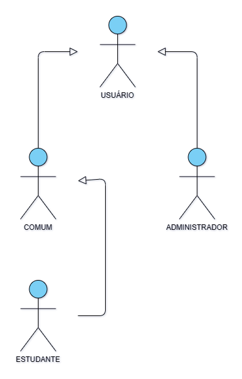 
        <figcaption> O diagrama acima mostra a especialização/generalização de entidades/atores o que é definido como herança em POO (Paradigma orientado a objetos).
        </figcaption>
  

</figure>

* **Paradigma Orientado a Objetos**

O paradigma orientado a objetos (POO) é um modelo de programação que organiza o software em unidades chamadas objetos. Cada objeto representa uma instância de uma classe, que define um tipo específico de objeto. As classes podem ter atributos (dados) e métodos (funções) que operam nesses dados. O POO baseia-se em quatro princípios fundamentais:

| Princípio     | Conceito                                                                                                                                                              |
| ---------------- | ----------------------------------------------------------------------------------------------------------------------------------------------------------------------- |
| Abstração    | Foco nos aspectos essenciais de um objeto, ignorando detalhes irrelevantes para o contexto.                                                                           |
| Encapsulamento | Ocultação dos detalhes de implementação de um objeto, permitindo que apenas métodos autorizados acessem e modifiquem seus dados internos.                        |
| Herança       | Capacidade de uma classe herdar atributos e métodos de outra classe, permitindo a reutilização de código e a criação de hierarquias de classes.                 |
| Polimorfismo   | Capacidade de um objeto se comportar de diferentes maneiras, dependendo do contexto. Isso permite que objetos de classes diferentes sejam tratados de forma uniforme. |

- **Casos de Uso**:

| Ação                     | Descrição                                                      | Atores                                        |
| ---------------------------- | ------------------------------------------------------------------ | ----------------------------------------------- |
| Login()                    | Ação de autenticação do usuário do sistema                  | Todos os atores                               |
| Cadastro()                 | Cadastro de dados e currículo dos atores                        | Todos os atores exceto Usuário Administrador |
| Exibir perfil()            | Exibição de dados do perfil                                    | Todos os atores                               |
| Alterar dados cadastrais() | Alteração de dados cadastrais                                  | Usuários comuns e estudantes                 |
| Excluir conta()            | Exclusão de conta                                               | Todos os atores exceto Usuário Administrador |
| Candidatar em vaga()       | Candidatura em vaga                                              | Usuários comuns e estudantes                 |
| Desistir da vaga()         | Cancelamento de candidatura em vaga                              | Usuários comuns e estudantes                 |
| Ver vagas candidatadas()   | Exibição de lista de vagas cadastradas e status da candidatura | Todos os atores                               |
| Cadastrar vaga()           | Cadastro de vagas no sistema                                     | Usuário Administrador                        |
| Editar vaga()              | Edição de vagas cadastradas                                    | Usuário Administrador                        |
| Remover vaga()             | Remoção de vagas cadastradas                                   | Usuário Administrador                        |
| Bloquear candidato()       | Bloqueio/Congelamento de conta de candidato                      | Usuário Administrador                        |

- **Cenários**:

| TIPO | ID  | NOME        | DESCRIÇÃO                                                                                                                                                                                                  |
| ------ | :---- | ------------- | -------------------------------------------------------------------------------------------------------------------------------------------------------------------------------------------------------------- |
| UC   | 001 | LOGIN       | NESTE CENÁRIO O USUÁRIO CONSEGUE LOGAR NORMALMENTE, É AUTENTICADO E TEM ACESSO AOS DEMAIS RECURSOS DO APLICATIVO.                                                                                         |
| UC   | 002 | LOGIN       | AO ERRAR A SENHA OU TENTAR ACESSAR SEM TER UMA CONTA AUTENTICADA. O USUÁRIO É IMPEDIDO DE ACESSAR AS FUNCIONALIDADES DO SISTEMA COM UMA MENSAGEM SUGERINDO QUE ENTRE COM UMA CONTA VÁLIDA OU CADASTRE-SE. |
| UC   | 003 | LOGIN       | O USUÁRIO NÃO POSSUI CONTA E ESCOLHE A OPÇÃO "CADASTRAR"                                                                                                                                                 |
| UC   | 004 | LOGIN       | O USUÁRIO ESQUECEU A SENHA E AO ESCOLHER A OPÇÃO "ESQUECEU SUA SENHA?". É DIRECIONADO A TRATATIVA DE RESET DE SENHA.                                                                                     |
| UC   | 005 | HOME        | AO ENTRAR NO APLICATIVO, O USUÁRIO PODERÁ. SE JÁ LOGADO, OBTER EM PRIMEIRO MOMENTO, UM PEQUENO HISTÓRICO DE VAGAS E SUGESTÕES BASEADAS EM SEU CURSO E HISTÓRICO DE PESQUISA.                           |
| UC   | 006 | HOME        | AINDA NA TELA INICIAL, O USUÁRIO TERÁ UMA IMAGEM-LINK QUE O GUIARÁ PARA O SITE/APLICATIVO ESTÁCIO.                                                                                                       |
| UC   | 007 | NAVEGAÇÃO | O USUÁRIO PODERÁ NAVEGAR ENTRE AS QUATRO TELAS BÁSICAS DO SISTEMA A QUALQUER MOMENTO ATRAVÉS DA BARRA DE NAVEGAÇÃO.                                                                                    |
| UC   | 008 | BUSCA       | O USUÁRIO CADASTRADO PODERÁ BUSCAR, FILTRAR E SE CANDIDATAR EM VAGAS DISPONÍVEIS NO SISTEMA.                                                                                                              |
| UC   | 009 | BUSCA       | O USUÁRIO AINDA NÃO CADASTRADO PODERÁ BUSCAR, FILTRAR, PORÉM AO TENTAR SE INSCREVER EM UMA VAGA, DEVERÁ SEGUIR PARA O CADASTRO.                                                                         |
| UC   | 010 | CADASTRO    | O USUARIO COMUM OU ESTUDANTE PODERÃO EFETUAR SEU CADASTRO COM DADOS PESSOAIS E CURRICULARES, SENDO QUE O ESTUDANTE DEVERÁ INFORMAR A MATRÍCULA, CURSO E SEMESTRE.                                         |
| UC   | 011 | CADASTRO    | O USUARIO ADMINISTRADOR PODERÁ CADASTRAR VAGAS AO SISTEMA.                                                                                                                                                  |
| UC   | 012 | EXIBIR      | OS DADOS DO USUÁRIO SERÃO CRIPTOGRAFADOS. PORTANTO, APENAS ALGUNS DADOS SERÃO EXIBIDOS (PÚBLICOS) PARA REFERÊNCIA QUANTO AOS REQUISITOS DAS VAGAS.                                                      |
| UC   | 013 | EXIBIR      | APENAS O ADMINISTRADOR E O PRÓPRIO USUÁRIO CADASTRADO PODERÃO TER ACESSO AOS SEUS DADOS CRIPTOGRAFADOS.                                                                                                   |
| UC   | 014 | EDIÇÃO    | USUÁRIO EDITA SEUS DADOS.                                                                                                                                                                                   |
| UC   | 015 | EDIÇÃO    | ADMINISTRADOR EDITA AS VAGAS CADASTRADAS.                                                                                                                                                                    |
| UC   | 016 | DELETE      | O USUÁRIO COMUM OU ESTUDANTE EXCLUI SUA CONTA.                                                                                                                                                              |
| UC   | 017 | DELETE      | O USUÁRIO ADMINISTRADOR EXCLUI A VAGA ANTERIORMENTE CADASTRADA.                                                                                                                                             |
| UC   | 018 | BLOQUEIA    | O USUÁRIO ADMINISTRADOR BLOQUEIA A CONTA DO USUÁRIO COMUM OU ESTUDANTE.                                                                                                                                    |

#### Diagramas de casos de uso 🚧

O diagrama de casos de uso possui uma importância complementar, pois não cabe em todos os cenários propostos pela aplicação e nos que cabe, filtra-se apenas aqueles em que realmente possa auxiliar no entendimento do processo.

<figure align="center">
  

     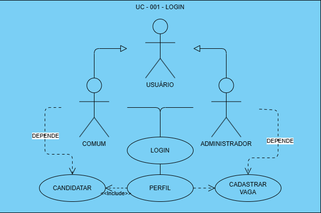 
        <figcaption> O diagrama acima demonstra o reuso utilizado em POC (Paradigma orientado a componentes).
        </figcaption>
  

</figure>

Paradigma Orientado a Componentes:
O paradigma orientado a componentes (POC) é um modelo de desenvolvimento de software que se concentra na construção de sistemas a partir de componentes reutilizáveis e independentes. Os componentes são unidades de software que encapsulam funcionalidades específicas e podem ser compostos para formar sistemas mais complexos. As principais características do POC incluem:

- Reutilização
- Encapsulamento
- Composição
- Integração

Embora o POO e o POC tenham abordagens diferentes, ambos visam promover a reutilização, a modularidade e a manutenibilidade do software, cada um com suas próprias técnicas e princípios.

<figure align="center">
  

     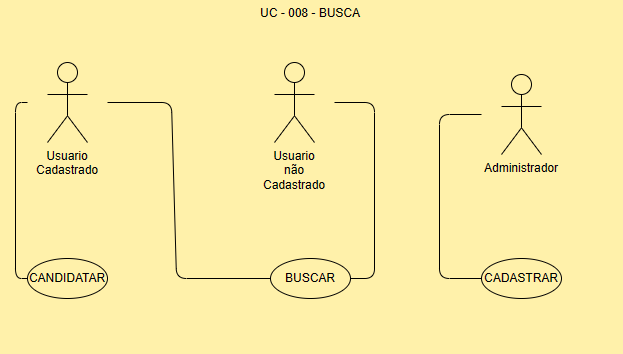 
        <figcaption>O diagrama acima mostra o comportamento principal dos três níveis de uruário em relação as vagas. Neste cenário, o administrador cadastra as vagas que são buscadas e acessadas pelos usuários cadastrados e não cadastrados, porém apenas usuários cadastrados poderão se candidatar a elas.
        </figcaption>
  

</figure>

---

> ### Documentação de Arquitetura

---

#### Visão geral da arquitetura do sistema

A documentação de arquitetura para um projeto React Native descreve a estrutura e o design geral do sistema, incluindo a organização dos componentes, a comunicação entre eles e a forma como o sistema é implantado. Essa documentação fornece informações detalhadas sobre a arquitetura do projeto, facilitando o entendimento e a manutenção do código por parte dos desenvolvedores.

Um projeto React Native pode ser tanto monolítico quanto baseado em microserviços, dependendo da arquitetura escolhida para o desenvolvimento. Vamos entender a diferença entre os dois:

1. **Monolítico** : Um aplicativo monolítico é aquele em que todas as funcionalidades são desenvolvidas e implantadas como um único sistema. Isso significa que todas as partes do aplicativo, como a interface do usuário, a lógica de negócios e o acesso a dados, estão contidas em um único código-base e são implantadas como uma única unidade. Nesse caso, um projeto React Native monolítico teria toda a lógica do aplicativo (telas, regras de negócio, acesso a dados, etc.) dentro de um único aplicativo React Native.
2. **Microserviços** : Um aplicativo baseado em microserviços é aquele em que as funcionalidades são divididas em serviços independentes, cada um responsável por uma parte específica da aplicação. Cada microserviço é desenvolvido, implantado e escalado de forma independente, o que permite uma maior flexibilidade e escalabilidade do sistema como um todo. Nesse caso, um projeto React Native baseado em microserviços teria cada serviço sendo executado em seu próprio ambiente, e a comunicação entre eles seria feita por meio de APIs.

#### Diagramas de arquitetura

1. Diagrama de Componentes de Acesso a Dados: 🚧

<figure align="center">
  

     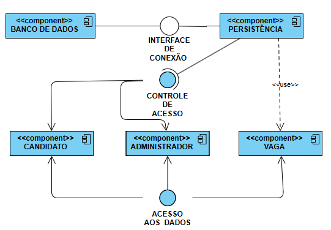    
  

</figure>

2. Diagrama de Fluxo de Dados: 🚧

<figure align="center">
  

     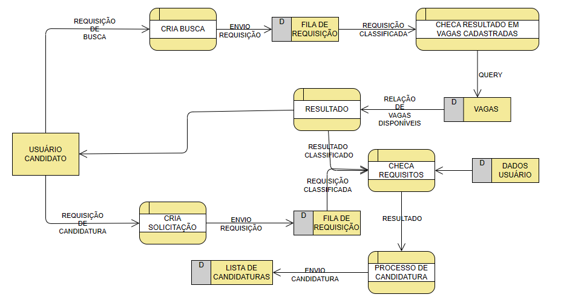    
  

</figure>

3. Diagrama Físico de dados: 🚧

<figure align="center">
  

     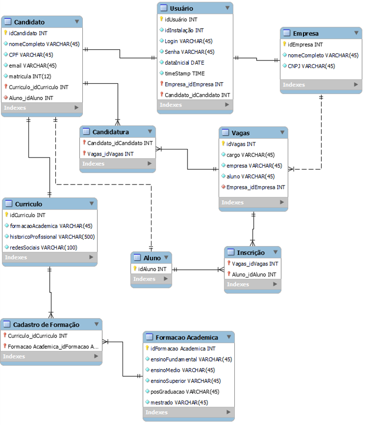   
         <figcaption>Para criar este diagrama, utilizamos o MySQL pois foi o SGBDR utilizado para criar a nossa base de dados.
        </figcaption> 
  

</figure>

#### Principais Componentes

| TIPO    | NOME        | DESCRIÇÃO                                                                                                          |
| --------- | ------------- | ---------------------------------------------------------------------------------------------------------------------- |
| INTERNO | VIEWS       | SÃO AS TELAS (VISUALIZAÇÃO) RESPONSÁVEISO POR EXIBIR AS INTERAÇÕES DO SISTEMA PARA O USUÁRIO.                 |
| EXTERNO | VIEW        | COMPONENTE RESPONSÁVEL POR AGRUPAR OUTROS COMPONENTES. UTILIZADO AMPLAMENTE EM TODOS OS COMPONENTES VIZUAIS.        |
| INTERNO | STYLESHEETS | FOLHAS DE ESTILO EQUIVALENTE AO CSS EM SISTEMAS WEB. RESPONSÁVEL POR APLICAR ESTILOS AOS COMPONENTES VISUAIS.       |
| EXTERNO | TEXT        | COMPONENTE UTILIZADO PARA INSERIR TEXTO AOS COMPONENTES VIZUAIS.                                                     |
| INTERNO | ENTITIES    | SEMELHANTE A MODEL DA ARQUITETURA MVC. REPRESENTA AS ENTIDADES, ATORES E SUAS FUÇÕES.                              |
| INTERNO | NAVIGATORS  | RESPONSÁVEIS PELA COMUNICAÇÃO E NAVEGAÇÃO ENTRE TELAS                                                           |
| INTERNO | CONTROLLERS | RESPONSÁVEL PELA COMUNICAÇÃO ENTRE NAVIGATOR, VIEWS E MODELS.                                                     |
| INTERNO | APP         | COMPONENTE PRINCIPAL DA APLICAÇÃO, ONDE OCORRE A NAVEGAÇÃO PRINCIPAL ENTRE TELAS E EMPILHAMENTO DE NAVEGAÇÕES. |

Estes componentes foram melhor detalhados na documentação de design.

#### Decisões Arquiteturais e Justificativas

A escolha da arquitetura **monolítica** foi apropriada em várias sentidos, e que dependeu dos requisitos e das características do projeto. Algumas razões paraa escolhaarquitetura monolítica incluem:

1. **Simplicidade**: Uma arquitetura monolítica é mais simples de entender, desenvolver e manter em comparação com arquiteturas distribuídas ou baseadas em microserviços. Isso é vantajoso no caso de nossa equipe pequena e pouco experiente.
2. **Custo** : A construção e a manutenção de uma aplicação monolítica geralmente requerem menos infraestrutura e recursos em comparação com arquiteturas distribuídas, o que pode ser mais econômico para pequenas e médias empresas.
3. **Desenvolvimento rápido** : Uma arquitetura monolítica pode permitir um desenvolvimento mais rápido, pois os desenvolvedores podem se concentrar em uma única aplicação sem a complexidade adicional de gerenciar várias partes independentes.
4. **Facilidade de implantação** : Implantar uma aplicação monolítica é mais simples do que implantar uma aplicação distribuída, pois envolve apenas a implantação de um único artefato.
5. **Menos complexidade inicial** : Para projetos que não exigem escalabilidade imediata ou que têm requisitos de negócios relativamente simples, uma arquitetura monolítica pode ser uma escolha adequada devido à sua menor complexidade inicial.

---

> ### Documentação de Design

---

#### Diagramas

1. **Diagrama de Classes** 🚧

O diagrama de classes é uma ferramenta fundamental na modelagem de sistemas orientados a objetos, como é o caso de muitas aplicações desenvolvidas em React Native. Ele desempenha várias funções importantes:

<figure align="center">
  

     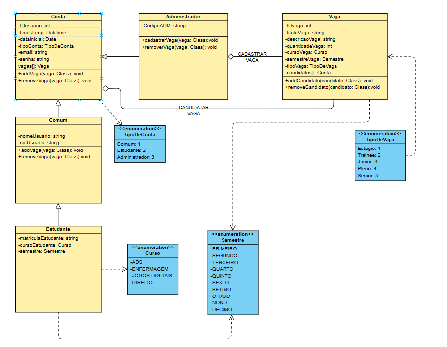   
  

</figure>

#### Especificações Detalhadas de Componentes

1. **Componentes Internos** 🚧

| TIPO       | NOME                 | DESCRIÇÃO                                                                                                          |
| ------------ | ---------------------- | ---------------------------------------------------------------------------------------------------------------------- |
| VIEW       | App.js               | COMPONENTE PRINCIPAL DA APLICAÇÃO, ONDE OCORRE A NAVEGAÇÃO PRINCIPAL ENTRE TELAS E EMPILHAMENTO DE NAVEGAÇÕES. |
| VIEW       | Busca.js             | TELA DE BUSCA POR VAGAS.                                                                                             |
| VIEW       | Cadastro.js          | TELA DE CADASTRO DE USUÁRIO COMUM OU ESTUDANTE.                                                                     |
| VIEW       | ~~Contato.js~~       | TELA A SER MODIFICADA.                                                                                               |
| VIEW       | Home.js              | TELA INICIAL >> PRIMEIRAS INFORMAÇÕES.                                                                             |
| VIEW       | Perfil.js            | NOME A SER AJUSTADO. TELA DE LOGIN.                                                                                  |
| CONTROLLER | PerfillStack.js      | INTERFACE DE NAVEGAÇÃO ENTRE A TELA DE LOGIN E CADASTRO.                                                           |
| CONTROLLER | TabNavigatorStack.js | INTERFACE DE NAVEGAÇÃO ENTRE A BARRA DE NAVEGAÇÃO E AS QUATRO TELAS BÁSICAS INICIAIS.                           |
| MODEL      | Entidades.tsx        | TODAS AS ENTIDADES CONTIDAS NESTE SISTEMA.                                                                           |
| STYLESHEET | estilo-busca.js      | FOLHA DE ESTILO DE COMPONENTES INDIVIDUAIS DA TELA BUSCA.                                                            |
| STYLESHEET | estilo-geral.js      | FOLHA DE ESTILO DE COMPONENTES PADRÕES EM TODO O APLICATIVO.                                                        |
| STYLESHEET | estilo-perfil.js     | FOLHA DE ESTILO DE COMPONENTES INDIVIDUAIS DA TELA DE LOGIN.                                                         |
| STYLESHEET | estilo-home.js       | FOLHA DE ESTILO DE COMPONENTES INDIVIDUAIS DA TELA INICIAL.                                                          |
| VIEW       | HeaderMain.js        | CABEÇALHO >> NOME DO APLICATIVO + LOGOTIPO                                                                          |

2. **Componentes Externos** 🚧

| NOME                     | PACOTE                        | DESCRIÇÃO                                                                                                                                                                                                            |
| :------------------------- | ------------------------------- | ------------------------------------------------------------------------------------------------------------------------------------------------------------------------------------------------------------------------ |
| View                     | react-native                  | COMPONENTE UTILIZADO PARA AGRUPAR OUTROS COMPONENTES E CRIAR LAYOUTS. É SEMELHANTE A UMA`
` EM APLICAÇÕES WEB.                                                                                                  |
| SafeAreaView             | react-native                  | COMPONENTE QUE GARANTE QUE SEU CONTEÚDO NÃO SEJA SOBREPOSTO PELA ÁREA DE STATUS DO DISPOSITIVO. É ÚTIL PARA EVITAR QUE CONTEÚDO SEJA CORTADO EM DISPOSITIVOS COM ENTALHE (NOTCH) OU BARRA DE STATUS.             |
| Image                    | react-native                  | COMPONENTE UTILIZADO PARA EXIBIR IMAGENS. PODE EXIBIR IMAGENS LOCAIS (DO DISPOSITIVO) OU REMOTAS (DA INTERNET).                                                                                                        |
| Stylesheet               | react-native                  | OBJETO UTILIZADO PARA DEFINIR ESTILOS EM COMPONENTES REACT NATIVE.                                                                                                                                                     |
| Text                     | react-native                  | COMPONENTE UTILIZADO PARA EXIBIR TEXTO NA INTERFACE DO USUÁRIO. SUPORTA ESTILOS, COMO COR, TAMANHO DA FONTE E ALINHAMENTO.                                                                                            |
| TextInput                | react-native                  | COMPONENTE UTILIZADO PARA RECEBER ENTRADA DE TEXTO DO USUÁRIO. É SEMELHANTE A UM`<INPUT>` EM APLICAÇÕES WEB.                                                                                                       |
| TouchableOpacity         | react-native                  | COMPONENTE UTILIZADO PARA ENVOLVER OUTROS COMPONENTES E ADICIONAR UM EFEITO DE "TOQUE" QUANDO PRESSIONADO, FORNECENDO FEEDBACK VISUAL AO USUÁRIO.                                                                     |
| Switch                   | react-native                  | OMPONENTE UTILIZADO PARA REPRESENTAR UM INTERRUPTOR DE DUAS OPÇÕES (LIGADO/DESLIGADO). É SEMELHANTE A UMA CAIXA DE SELEÇÃO (CHECKBOX) EM APLICAÇÕES WEB.                                                        |
| NavigationContainer      | @react-navigation/native      | COMPONENTE UTILIZADO PARA ENVOLVER A NAVEGAÇÃO EM UMA APLICAÇÃO REACT NATIVE. É RESPONSÁVEL POR GERENCIAR O ESTADO DA NAVEGAÇÃO E RENDERIZAR A NAVEGAÇÃO COM BASE NOS COMPONENTES DE NAVEGAÇÃO FORNECIDOS. |
| createBottomTabNavigator | @react-navigation/bottom-tabs | FUNÇÃO UTILIZADA PARA CRIAR UM NAVEGADOR DE ABAS NA PARTE INFERIOR DE UMA APLICAÇÃO REACT NATIVE. PERMITE DEFINIR AS ROTAS E AS OPÇÕES DE CADA ABA, BEM COMO A CONFIGURAÇÃO GERAL DO NAVEGADOR.                |
| useNavigation            | @react-navigation/native      | HOOK UTILIZADO PARA OBTER O OBJETO DE NAVEGAÇÃO EM COMPONENTES FUNCIONAIS DENTRO DE UM NAVEGADOR. PERMITE ACESSAR FUNÇÕES DE NAVEGAÇÃO, COMO NAVIGATE E GOBACK, E O ESTADO DA NAVEGAÇÃO.                       |
| useState                 | react                         | HOOK UTILIZADO PARA ADICIONAR ESTADO A COMPONENTES FUNCIONAIS EM REACT. PERMITE DEFINIR E ATUALIZAR O ESTADO DE UM COMPONENTE, DISPARANDO UMA RE-RENDERIZAÇÃO QUANDO O ESTADO É ALTERADO.                           |
| React                    | react                         | BIBLIOTECA JAVASCRIPT UTILIZADA PARA CRIAR INTERFACES DE USUÁRIO INTERATIVAS. É A BASE DO REACT NATIVE E FORNECE OS COMPONENTES E API NECESSÁRIOS PARA O DESENVOLVIMENTO DE APLICAÇÕES REACT NATIVE.              |
| LinearGradient           | expo-linear-gradient          | COMPONENTE UTILIZADO PARA CRIAR UM PLANO DE FUNDO LINEAR GRADIENTE EM COMPONENTES REACT NATIVE. PERMITE DEFINIR AS CORES E A ORIENTAÇÃO DO GRADIENTE, CRIANDO UM EFEITO VISUAL ATRAENTE.                             |
| Card                     | react-native-papper           | COMPONENTE UTILIZADO PARA EXIBIR UM CONTEÚDO EM UM CARTÃO ESTRUTURADO EM REACT NATIVE. PODE SER UTILIZADO PARA EXIBIR INFORMAÇÕES DE FORMA ORGANIZADA E DESTACADA.                                                 |

#### Design de Interfaces de Usuário 🚧

    <figure style="margin-right: 20px;">
        

            <figcaption style="text-align: center;"><b>Tela Inicial</b></figcaption>
             
        

    </figure>
    <figure style="margin-left: 20px;">
        

            <figcaption style="text-align: center;"><b>Tela de Busca</b></figcaption>
            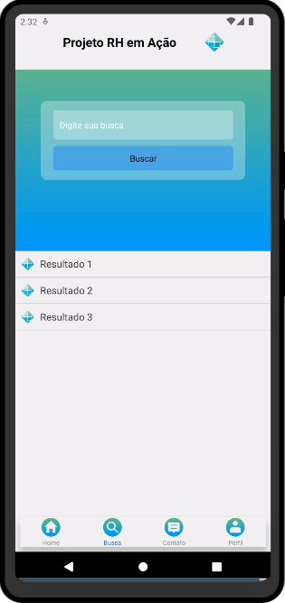 
        

    </figure>

    <figure style="margin-right: 20px;">
        

            <figcaption style="text-align: center;"><b>Tela de Login</b></figcaption>
            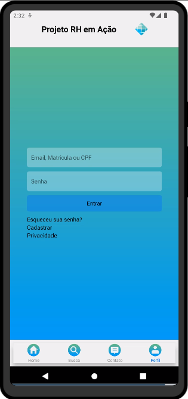 
        

    </figure>
    <figure style="margin-left: 20px;">
        

            <figcaption style="text-align: center;"><b>Tela de Cadastro Comum</b></figcaption>
            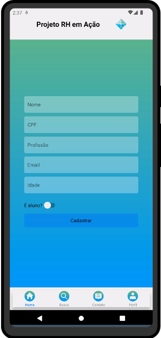 
        

    </figure>

<figure align="center">
  

     <figcaption style="text-align: center;"><b>Tela de Cadastro Estudante</b></figcaption>
     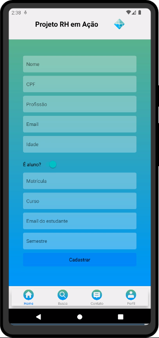   
  

</figure>

#### Padrões de design utilizados

Decidimos utilizar a arquitetura monolítica em um modelo de design **MVC** (Model-View-Controler) adaptado. Este é um modelo padrão de arquitetura de software amplamente utilizado para desenvolver interfaces de usuário em aplicações web e móveis, incluindo aplicações React Native. Ele divide uma aplicação em três componentes principais:

1. **Model (Modelo)** : O modelo representa os dados e a lógica de negócios da aplicação. Ele é responsável por gerenciar o estado da aplicação e responder a solicitações de leitura e escrita dos dados. No contexto do React Native, o modelo pode ser implementado usando componentes de classe ou hooks para gerenciar o estado local da aplicação.
2. **View (Visualização)** : A visualização é responsável por exibir a interface do usuário e interagir com o usuário. No React Native, as visualizações são implementadas como componentes React que renderizam elementos na tela e respondem a eventos de usuário, como toques e gestos.
3. **Controller (Controlador)** : O controlador atua como intermediário entre o modelo e a visualização. Ele recebe entrada do usuário da visualização, atualiza o modelo conforme necessário e atualiza a visualização para refletir as mudanças no estado da aplicação. No React Native, o controlador pode ser implementado como parte da lógica de componente ou usando gerenciadores de estado como o Redux.

O modelo MVC ajuda a separar as preocupações da aplicação, tornando mais fácil manter e entender o código. Ele também facilita a reutilização de código e a implementação de novas funcionalidades, pois as mudanças em um componente não afetam diretamente os outros componentes.

---

> ### Documentação de Testes

---

Esta documentação será produzida durante a próxima fase do projeto onde testaremos a versão beta.

---

> ### Documentação de Código

---

#### Comentários no Código-Fonte

Esta documentação está em desenvolvimento com comentários nos próprios componentes do projeto e poderão ser conferidos em: [React-Native/app-vagas at main · Daniloha/React-Native (github.com)](https://github.com/Daniloha/React-Native/tree/main/app-vagas)

#### Dicionario de Dados

- **Classes /Entidades**

1. **Vagas** 🚧

| Atributo       | Tipo       | Descrição                                                                                                                              |
| ---------------- | ------------ | ------------------------------------------------------------------------------------------------------------------------------------------ |
| idVaga         | int        | Chave primária de identificação para instâncias desta entidade. Única, não nula, incremental e representada por números inteiros. |
| tituloVaga     | String     | Nome (Palavra chave) da vaga.                                                                                                            |
| descricaoVaga  | String     | Descrição da vaga                                                                                                                      |
| quantidadeVaga | int        | Representa o número de profissionais demandados para esta função.                                                                     |
| cursoVaga      | curso      | Enumerador do tipo string representando os cursos requeridos para esta vaga.                                                             |
| semestrVaga    | semestre   | Enumerador do tipo string representando o semestre em curso recomendado para esta vaga.                                                  |
| tipoVaga       | TipoDeVaga | Enumerador do tipo string representando o tipo de vaga: Estágio, Traineee, Junior e etc.                                                |

2. **Conta**

| Atributo       | Tipo        | Descrição                                                                                                                              |
| ---------------- | ------------- | ------------------------------------------------------------------------------------------------------------------------------------------ |
| idUsuario      | int         | Chave primária de identificação para instâncias desta entidade. Única, não nula, incremental e representada por números inteiros. |
| time_Stamp     | Datetime    | Registra a hora exata em que uma Conta é instanciada.                                                                                   |
| data_Inicial   | Date        | Registra a data exata em que uma Conta é instanciada.                                                                                   |
| tipoConta      | TipoDeConta | Enumerador do tipo string representando o tipo de conta: Comum, Estudante ou Administrador.                                              |
| emailConta     | String      | Email do usuário do sistema.                                                                                                            |
| senhaConta     | String      | Senha do usuario do sistema.                                                                                                             |
| nomeUsuario    | String      | Nome do usuario do sistema.                                                                                                              |
| cpfUsuario     | String      | CPF do usuario do sistema.                                                                                                               |
| matriculaAluno | String      | Matricula apenas para Conta Aluno.                                                                                                       |
| cursoAluno     | curso       | Curso apenas para Conta Aluno.                                                                                                           |
| semestreAluno  | semestre    | Semestre apenas para Conta Aluno.                                                                                                        |

3. **Composição de Contas**

|    Atributo    | Comum | Estudante | Administrador |
| :--------------: | :-----: | :---------: | :-------------: |
|   idUsuario   | ✔️ |   ✔️   |     ✔️     |
|   time_Stamp   | ✔️ |   ✔️   |     ✔️     |
|  data_Inicial  | ✔️ |   ✔️   |     ✔️     |
|   tipoConta   | ✔️ |   ✔️   |     ✔️     |
|   emailConta   | ✔️ |   ✔️   |      ❌      |
|   senhaConta   | ✔️ |   ✔️   |      ❌      |
|  nomeUsuario  | ✔️ |   ✔️   |      ❌      |
|   cpfUsuario   | ✔️ |   ✔️   |      ❌      |
| matriculaAluno |  ❌  |   ✔️   |      ❌      |
|   cursoAluno   |  ❌  |   ✔️   |      ❌      |
| semestreAluno |  ❌  |   ✔️   |      ❌      |

4. **Backlog / Registros**

| Atributo        | Tipo     | Descrição                                                                                                                              |
| ----------------- | ---------- | ------------------------------------------------------------------------------------------------------------------------------------------ |
| idEvento        | int      | Chave primária de identificação para instâncias desta entidade. Única, não nula, incremental e representada por números inteiros. |
| time_Stamp      | DateTime | Registra a hora exata em que um Evento ocorre.                                                                                           |
| data_Inicial    | Date     | Registra a data exata em que um Evento ocorre.                                                                                           |
| tipoEvento      | String   | Descreve o tipo de evento ocorrido.                                                                                                      |
| descricaoEvento | String   | O evento em si.                                                                                                                          |

- **Enumeradores**

1. **TipoDeConta**

| String |   |               |
| -------- | --- | --------------- |
| 1      | : | Comum         |
| 2      | : | Estudante     |
| 3      | : | Administrador |

2. **TipoDeVaga**

| String |   |         |
| -------- | --- | --------- |
| 1      | : | Estagio |
| 2      | : | Trainee |
| 3      | : | Junior  |
| 4      | : | Pleno   |
| 5      | : | Senior  |

3. **Curso**🚧

| col1 | col2 | col3 |
| ------ | ------ | ------ |
|      |      |      |
|      |      |      |

4. **Semestre**🚧

| col1 | col2 | col3 |
| ------ | ------ | ------ |
|      |      |      |
|      |      |      |

> ### Documentação do Usuário

---

Esta documentação será desenvolvida durante a fase final do projeto.

---

> ### Documentação de Manutenção:

---

Esta documentação será desenvolvida durante a fase final do projeto.

---

🚧 🚧 🚧 🚧 🚧 🚧 🚧 🚧 🚧 🚧 🚧 🚧 🚧 🚧 🚧 🚧 🚧 🚧 🚧 🚧 🚧 🚧 🚧 🚧 🚧 🚧 🚧 🚧 🚧 🚧 🚧 🚧 🚧 🚧
